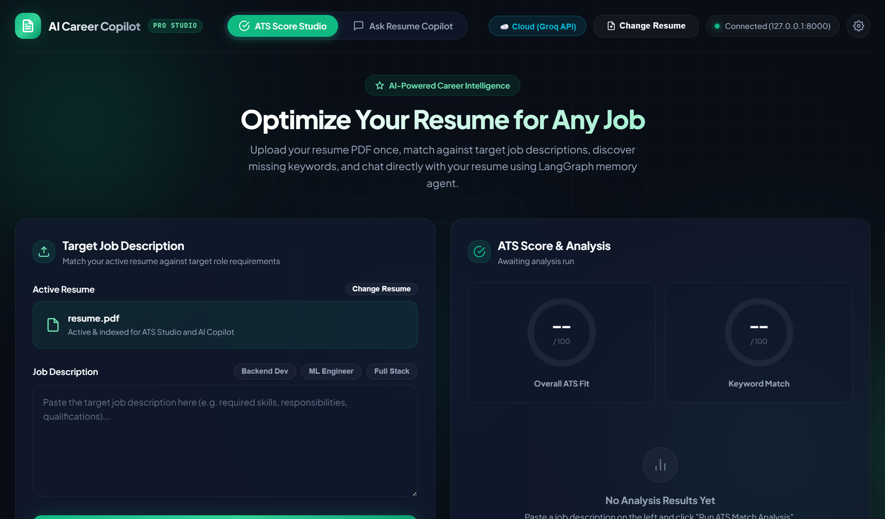
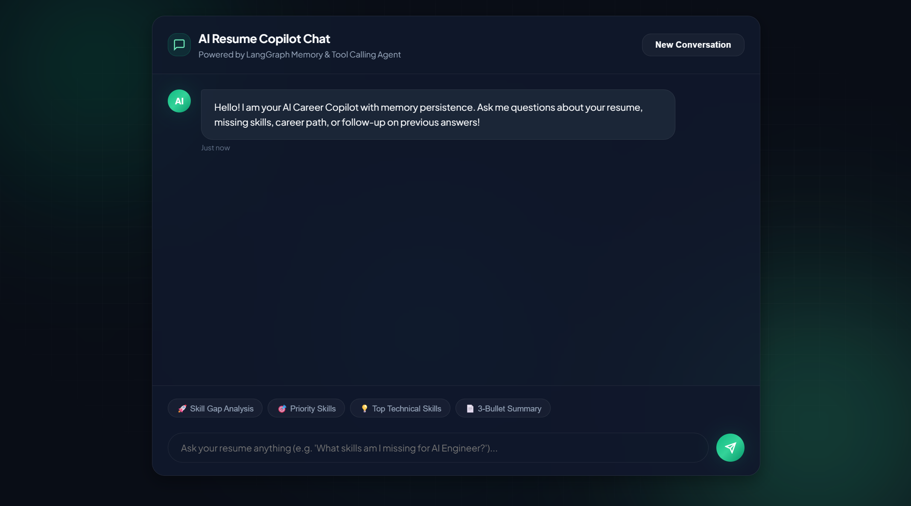

# AI Career Copilot

An intelligent career assistant and Human-in-the-Loop resume optimization platform powered by LangGraph, Retrieval-Augmented Generation (RAG), and dual-provider LLM orchestration.

---

## 30-Second Overview

In today's hyper-competitive job market, generic resumes rarely pass automated Applicant Tracking Systems (ATS) or capture recruiter attention. Candidates must tailor their resumes almost daily for different roles, balancing ATS keyword alignment, technical depth, and quantifiable achievements. Manually rewriting resumes for dozens of applications is slow, error-prone, and exhausting.

**AI Career Copilot** solves this problem:
1. **Indexes your entire career history** in a semantic vector store so your actual accomplishments are never forgotten or hallucinated.
2. **Conducts deep ATS & role-fit gap analyses** against target job descriptions in real time.
3. **Rewrites resume sections with Human-in-the-Loop approval**, presenting side-by-side before/after diffs with ATS impact explanations.
4. **Instantly compiles professional, ATS-compliant PDFs** ready for submission with a single click.


*Figure 1: ATS Score Studio with real-time role matching, keyword gap analysis, and dual-provider toggling.*


*Figure 2: AI Career Copilot Chat powered by LangGraph memory persistence and autonomous tool calling.*

---

## Core Capabilities

- **Autonomous Agentic Copilot**: Built with LangChain and LangGraph. The agent intelligently selects tools (`search_resume`, `analyze_resume_for_job`, `analyze_skill_gap`, `propose_resume_edit`) based on user intent.
- **Human-in-the-Loop (HITL) Resume Editing**: Modifications are never applied blindly. The LangGraph state machine interrupts execution, generates an interactive diff card with ATS rationale, allows iterative refinement, and requires human confirmation before updating the active resume.
- **RAG Semantic Search Engine**: ChromaDB vector index with `sentence-transformers/all-MiniLM-L6-v2` embeddings, achieving **90.00% Recall@4** and **83.33% MRR@4** on resume query benchmarks.
- **Dual-Provider Architecture**:
  - **Cloud (Groq API)**: Sub-second conversational responses (**0.81s P50 latency**, 246.7 tokens/sec) for real-time interaction.
  - **Local (Ollama On-Device)**: Local inference keeps model execution on-device with no external LLM API calls.
- **Executive PDF Generation**: High-quality PDF compilation using ReportLab with clean typographic hierarchy, contact rows, and ATS-parseable layout blocks.
- **One-Click Revert & Memory Reset**: Full rollback to the original resume backup with synchronized vector re-indexing and conversational thread memory cleanup.

---

## System Architecture

```
                       +---------------------------------------+
                       |           Frontend (Web UI)           |
                       | Vanilla JS, CSS Glassmorphism, Diff UI|
                       +-------------------+-------------------+
                                           | HTTP / REST
                                           v
+-----------------------------------------------------------------------------------+
|                            Backend Service (FastAPI)                             |
|                                                                                   |
|  +---------------------+   +---------------------+   +-------------------------+  |
|  |   LangGraph Agent   |-->| LangGraph HITL Graph|-->| ReportLab PDF Generator |  |
|  | (Tool Orchestration)|   | (Interrupt & Diff)  |   |   (ATS-Compliant PDF)   |  |
|  +----------+----------+   +----------+----------+   +-------------------------+  |
|             |                         |                                           |
|             v                         v                                           |
|  +---------------------+   +---------------------+                                |
|  | Dual LLM Router     |   | Vector Store Manager|                                |
|  | - Cloud: Groq LPU   |   | - ChromaDB          |                                |
|  | - Local: Ollama 7B  |   | - Dynamic Reindexing|                                |
|  +---------------------+   +----------+----------+                                |
+---------------------------------------|-------------------------------------------+
                                        | HTTP (Port 8001)
                                        v
                       +---------------------------------------+
                       |       Microservice: Embeddings        |
                       |    sentence-transformers (MiniLM)     |
                       +---------------------------------------+
```

---

## Quickstart: How to Run

### Option A: Using Docker Compose (Recommended)

Run the entire microservice stack with a single command:

1. **Clone the repository**:
   ```bash
   git clone https://github.com/Mayank149/AI-Career-Copilot-Complete-.git
   cd AI-Career-Copilot-Complete-
   ```

2. **Configure environment variables**:
   Create a `.env` file in the root directory (or copy `.env.example`):
   ```bash
   GROQ_API_KEY=your_groq_api_key_here
   LLM_PROVIDER=cloud
   GROQ_MODEL=openai/gpt-oss-120b
   ```

3. **Start the containers**:
   ```bash
   docker compose up --build
   ```
   - Backend runs on `http://localhost:8000`
   - Embedding service runs on `http://localhost:8001`

4. **Access the application**:
   Open `frontend/index.html` directly in your browser, or serve it with:
   ```bash
   python -m http.server 3000 --directory frontend
   ```
   Then navigate to `http://localhost:3000`.

---

### Option B: Local Setup (Without Docker)

You can run each service natively in separate terminals:

#### 1. Start the Embedding Service
```bash
cd embedding_service
python -m venv venv
# On Windows:
.\venv\Scripts\activate
# On Linux/macOS:
source venv/bin/activate

pip install -r requirements.txt
uvicorn main:app --port 8001
```

#### 2. Start the Backend API
In a new terminal:
```bash
cd backend
python -m venv venv
# On Windows:
.\venv\Scripts\activate
# On Linux/macOS:
source venv/bin/activate

pip install -r requirements.txt
uvicorn main:app --reload --port 8000
```

#### 3. Open the Frontend
Open `frontend/index.html` in any web browser.

*(Optional) For Local LLM usage: Ensure [Ollama](https://ollama.com/) is installed and running (`ollama serve`), then pull the model: `ollama pull qwen2.5:7b`.*

---

## Evaluation & Benchmarks

The system includes automated evaluation scripts under [`backend/evaluation/`](backend/evaluation/README.md) measuring retrieval quality and multi-provider latency:

| Dimension | Metric | Result | Industry Significance |
|---|---|---|---|
| **Vector Retrieval** | Recall@4 | **90.00%** | Relevant career context is surfaced in top 4 chunks 9 out of 10 times |
| **Vector Retrieval** | MRR@4 | **83.33%** | Measures how highly relevant context is ranked within the top 4 results |
| **Cloud Inference (Groq)** | P50 / P95 Latency | **0.81s / 1.20s** | Sub-second, interactive responses suitable for fluid chat |
| **Local Inference (Ollama)**| P50 / P95 Latency | **14.22s / 132.61s** | Keeps inference on-device with zero external API calls; influenced by host CPU constraints |
| **Cloud Speedup Factor** | Latency Ratio | **32.9x faster** | Demonstrates the latency tradeoff between cloud and local inference |

To run the evaluations:
```bash
# RAG Retrieval Quality Benchmark
python backend/evaluation/retrieval_eval.py

# Latency & Generation Speed Benchmark (P50/P95 over 40 inferences)
python backend/evaluation/latency_eval.py --provider both --runs 5 --save
```
*For detailed methodology, review the [Evaluation Report](backend/evaluation/README.md).*

---

## Future Scope & Roadmap

While AI Career Copilot already delivers end-to-end resume editing and analysis, future development focuses on:

1. **Multi-Template PDF & LaTeX Engine**:
   - Expansion beyond standard single-column layouts to customizable templates (Executive Classic, Modern Tech Minimalist, Academic Multi-Page).
   - Direct LaTeX compilation support (Overleaf-compatible) for typographic precision.
2. **Semantic Drift Guardrails**:
   - Automated factual-consistency scoring between original achievements and rewritten proposals to strictly prevent credential inflation or hallucination.
3. **Live ATS Score Telemetry**:
   - Real-time keyword density, hard-skill coverage, and parseability heatmaps showing candidates exactly how their revised draft compares to target job postings.
4. **Multi-Resume Profile Management**:
   - Supporting multiple base profiles (e.g., Data Science, Software Engineering, AI Research) with targeted one-click exports per industry track.

---

## License

This project is licensed under the MIT License.
